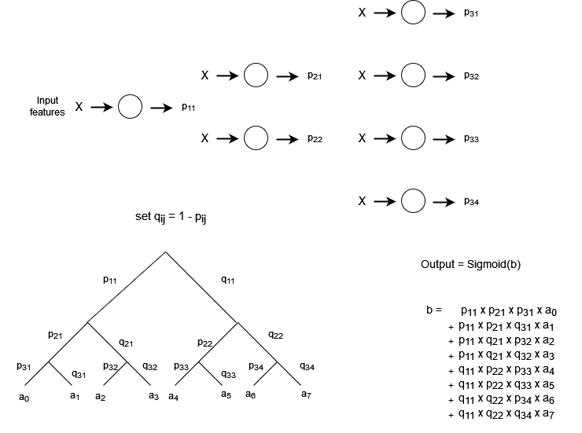
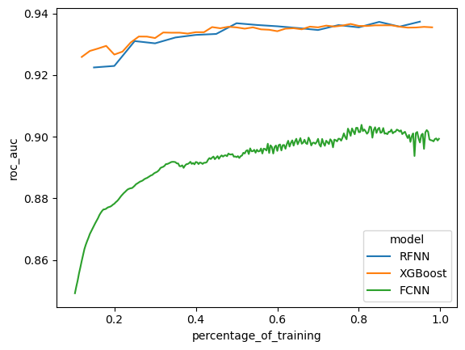

# Introduction

It is well known that traditional neural network architectures (i.e. fully connected neural networks) do not work well on small tabular datasets. In particular the performance of gradient boosted decision trees is usually better on such datasets. In this repository a neural network architecture is created that is inspired in decision trees and tries to translate them into a neural net framework. The new network is then compared to a fully connected network and a gradient boosted decision tree model on a popular small tabular dataset for classification. 

Note that this repository does not contain an exhausitve analysis of the new networks performance across multiple datasets but is rather thought as a proof of concept that the architecutre can work in principle. Also, there have been other attempts of creating neural networks for tabular data. A similar idea of copying the trees structure into a network can be found in [1] and a more complex model that according to the authors outperforms other approaches including XGBoost and CatBoost on a wide range of problems can be found in [2].

# Model Architecture

While traditional neural network setups compute new deep features from the inputs to later perform a simple regression task in their output layer, decision trees work by successively creating a direct decision boundary on the input domain and assigning a constant prediciton value to each separate subset produced by the decision boundary. 

Inspired by a single decision tree, we create a neural network structure that we will call Tree Neural Network (or TNN for short) that tries to mimic the way decision trees create their predictions. The model's structure is shown in figure 1. Identical to a decision tree the network has a depth $d$ and and there are $2^{i-1}$ nodes at every level $i \leq d$. Each node puts out a probability $p$ (to ensure $p$ in a straight forward way we use the sigmoid activation function within all nodes). Using the probabilites $p_{ij}$ we reconstruct a binary probability tree, where each leaf contains a real number $a \in \mathbb{R}$. To create the final output of the network the weighted sum of all leaves according to the probabilities is calculated and a final sigmoid function is applied to put out the predicted probability for the binary classification task. 

All nodes are thus linear layers with a one-dimensional output and the nodes' outputs are not used to create deep features but rather to construct a probability path to the prediction values $a$, which are in turn learnable parameters. This structure resembles a simple decision tree. However, there is an important distinction. In a decision tree the path through the tree is unambigious, i.e. a certain value corresponds to a fixed path that ends in a particular leaf and the leaf value is the prediction. In our network the prediciton is a weighted sum of the leaf values as the path is not deterministic but rather a collection of all possible paths that the network assigns different weights to. In order to give the network even more freedom when assigning the weights and in particular to make it possible to distinguish more sharply at certain nodes, we introduce an additional learnable parameter at every node: The steepness of the sigmoid function, that is we make the parameters $\alpha_{ij}$ in $$p_{ij} = Sigmoid(\alpha_{ij}(\mathbf{w_{ij}}\cdot \mathbf{X}))$$ learnable where usually one simply fixes $\alpha_{ij} = 1$

Finally, to not only replicate a single decision tree but a whole boosted forest, we copy the decision tree boosting algorithm as well. That is, we fix a growing rate $\eta$ and let $b_1$ be the logit output of our first tree after training (see figure 1), meaning that in particular the weights of tree 1 are fixed and will not be trained further. Then, we construct the second tree by optimizing the joint output $$Output_{forest} = Sigmoid(b_1 + \eta \cdot b_2)$$

and so on for every successive tree. We will call the boosting model including several trees a random forest neural network (RFNN).

<br/><br/><br/>

<center>
<figure>
    
     <p style='text-align: center'>
      <figurecaption>Figure 1: The TNN network architecture. Each node of the network puts out a probability $p_{ij}$. These are used to contruct a binary probability tree with leaf values $a_k$. The final output is a sigmoid function of the accordingly weighted sum of the leaf values. </figurecaption>
    </p>
</figure>
</center>

# Example Dataset

We will test our newly designed network architecture on a small binary classification dataset, namely the phenome dataset. The phenome dataset is freely availabe on openml.org and its goal is to distinguish between nasal and oral sounds given five different amplitude measures of the acoustic spectrum of the sound (Link: https://www.openml.org/search?type=data&status=active&id=44127). It contains a small amount of 3172 rows and five real-valued features. We perform a train-test split with 1000 samples in the test set and train our model on the remaining training set. For comparison we also fit a XGBooster Model of similar parameters and a fully connected neural network. The models are evaluated on their ROC-AUC Score on the validation set. The code for the basic TNN and the boosted RFNN as well as a wrapper for their training routine and the code used for the fully connected neural network can be found in the corresponding scripts within this repository.


```python
### Get packages
import openml
import numpy as np
import pandas as pd
import torch
import xgboost as xgb
import seaborn as sbn
from sklearn.model_selection import train_test_split
from sklearn.metrics import roc_auc_score

### Get RFNN and Fully Connected Network code of this repository
from rfnn_model import rfnn_a
from network_classes import fc_nn
from train_rfnn_function  import f_train_rfnn_model

### Set random seed, get phenom dataset and make train-validation split
rand_seed = 10
data = openml.datasets.get_dataset(44127).get_data()[0]
X_train, X_test, y_train, y_test = train_test_split(data.iloc[:,:5],data['Class'],test_size = 1000, random_state = rand_seed)
```

## Training the RFNN

We start by training our TNN-based boosted RFNN. We choose a depth of 6 and train a total of 20 trees within the boosted model. Each tree is trained for 400 epochs using a AdamW optimizer with learning rate 0.008. The growing rate for the boosted trees is set to 0.3. After finishing the training we will first train the other two models and afterwards compare the performance of all three.


```python
### Make pytorch as reproducible as possible
torch.manual_seed(rand_seed**3)
torch.use_deterministic_algorithms(True)

### Define model device and initialize model
model_device = torch.device('cpu')
model = rfnn_a(6,5,0.3).to(model_device) # depth = 6; input_features = 5; growing rate = 0.3

### Define training parameters: 20 trees in total, each trained for 400 epochs with a learning rate of 0.008
num_tnns = 20
num_epochs = 400
lr_rate = 0.008

### Transform targets into torch tensor. Training function converts X_* into tensors automatically but not the targets
y_train_torch = torch.tensor([1 if a == '2' else 0 for a in y_train.values], dtype = torch.float32).to(model_device)
y_test_torch = torch.tensor([1 if a == '2' else 0 for a in y_test.values], dtype = torch.float32).to(model_device)

### Do training; the function returns the ROC-AUC Score after finishing the training of each tree
rfnn_roc_aucs = f_train_rfnn_model(model, model_device, X_train, X_test, y_train_torch, y_test_torch, lr_rate, num_epochs, num_tnns)
```

    Finished tree number  1
    Finished tree number  2
    Finished tree number  3
    Finished tree number  4
    Finished tree number  5
    Finished tree number  6
    Finished tree number  7
    Finished tree number  8
    Finished tree number  9
    Finished tree number  10
    Finished tree number  11
    Finished tree number  12
    Finished tree number  13
    Finished tree number  14
    Finished tree number  15
    Finished tree number  16
    Finished tree number  17
    Finished tree number  18
    Finished tree number  19
    Finished tree number  20
    

## Training the XGBoost Classifier Model

XGBoost is one of the most popular and best performing packages to build gradient boosted decision trees. We will use it to construct a model on the same dataset we trained the RFNN on. For better comparison we will choose the same depth of 6 we used with the RFNN model and the same growing rate of 0.3. We will train a total of 60 trees but after training evaluate the performance of the model after each newly added base estimator.


```python
# Transform X_train and X_test into xgb.DMatrix to perform training on
dtrain = xgb.DMatrix(X_train, label = np.array([1 if a == '2' else 0 for a in y_train.values]))
dtest = xgb.DMatrix(X_test, label = np.array([1 if a == '2' else 0 for a in y_test.values]))

# Define parameters and evaluation matrix
param = {'max_depth': 6, 'objective': 'binary:logistic', 'random_state': rand_seed}
param['eval_metric'] = ['auc']
evallist = [(dtrain, 'train'), (dtest, 'eval')]

# Set number of boosting round to 1000 and train model
num_round = 50
bst = xgb.train(param, dtrain, num_round, evals = evallist, verbose_eval = False)

# For each of the constructed base estimators, make evaluate the model performance
# after finishing training of the base estimator.
xgb_roc_aucs = np.zeros((num_round))
for i in range(num_round):
    xgb_preds = bst.predict(dtest, iteration_range = (0, i +1))
    xgb_roc_aucs[i] = roc_auc_score(y_test, xgb_preds)
```

## Training a Fully Connected Network

As a second comparing model we will train a full connected network on the same dataset. A few different settings have been tried with similar success. In the end we used two hidden layers with 32 and 64 nodes respectively. The network is trained for a total of 200 epochs. 


```python
# Define model, learning rate and optimizer. The model uses two layers of 32 and 64 nodes.
# The activation function is a ReLU function and BatchNorm is used for both hidden layers.
lr_rate = 0.005
model = fc_nn(5, True, 2, [32,64], torch.nn.ReLU(), True, 1, torch.nn.Sigmoid()).to(model_device)
optim = torch.optim.AdamW(model.parameters(), lr = lr_rate)
num_epochs = 300

# Train the model and document the test ROC-AUC after each epoch of training
fc_nn_roc_aucs = np.zeros((num_epochs))
for n in range(num_epochs):
    
    curr_output = model(torch.tensor(X_train.values, dtype = torch.float32).to(model_device))
    loss = torch.nn.BCELoss()(torch.sigmoid(curr_output), y_train_torch)
    optim.zero_grad()
    loss.backward()
    optim.step()
    
    model.eval()
    curr_output_val = model(torch.tensor(X_test.values, dtype = torch.float32).to(model_device))
        
    model.train()
    fc_nn_roc_aucs[n] = roc_auc_score(y_test_torch.detach().clone().cpu().numpy(), torch.sigmoid(curr_output_val).detach().clone().cpu().numpy())
```

## Comparison of results

Finally we will compare the ROC-AUC scores for all of the three models trained.


```python
# Define three data frames containing the roc-auc scores on the test set. 
# We normalize the number of epochs / number of boosting rounds to be on the
# interval [0,1] for better comparison.
df_rfnn = pd.DataFrame({'percentage_of_training': np.arange(rfnn_roc_aucs.shape[0]) / rfnn_roc_aucs.shape[0],
              'roc_auc': rfnn_roc_aucs,
              'model': np.repeat('RFNN', rfnn_roc_aucs.shape[0])})
df_xgb = pd.DataFrame({'percentage_of_training': np.arange(xgb_roc_aucs.shape[0]) / xgb_roc_aucs.shape[0],
              'roc_auc': xgb_roc_aucs,
              'model': np.repeat('XGBoost', xgb_roc_aucs.shape[0])})
df_fc_nn = pd.DataFrame({'percentage_of_training': np.arange(fc_nn_roc_aucs.shape[0]) / fc_nn_roc_aucs.shape[0],
              'roc_auc': fc_nn_roc_aucs,
              'model': np.repeat('FCNN', fc_nn_roc_aucs.shape[0])})

# Concatenate the data frames and plot the results
df_plot = pd.concat((df_rfnn, df_xgb, df_fc_nn), ignore_index = True)
sbn.lineplot(df_plot[df_plot['percentage_of_training'] > 0.1], x = 'percentage_of_training', y = 'roc_auc', hue = 'model')
```


    <Axes: xlabel='percentage_of_training', ylabel='roc_auc'>


    

    


As we can see the performance of our RFNN model holds up with the XGBoost Classifier, a very good result for a model that was created just for fun. In particular, when comparing with a traditional fully connected network the improvement in performance is significant and shows that at least some advantages of decision trees can carry over to neural networks when accomodating the architecture of the latter accordingly, albeit that training takes significantly longer for the RFNN model. However, keep in mind that we did not spend much time hyper parameter tuning and the experiment presented is just a single split on a single dataset. Thus, as mentioned in the introduction this results is merely a proof of concept and certainly does not replace a more exhaustive analysis of the model. As mentioned as well above a better tested variation of neural networks that works on (small) tabular datasets can be found in [2].

## References

[1]: Wang, Aggarwal, Liu: Using a Random Forest to Inspire a Neural Network and Improving on It; 2017.

[2]: Arik, Pfister: TabNet: Attentive Interpretable Tabular Learning; arXiv:1908.07442v5, 2019.
